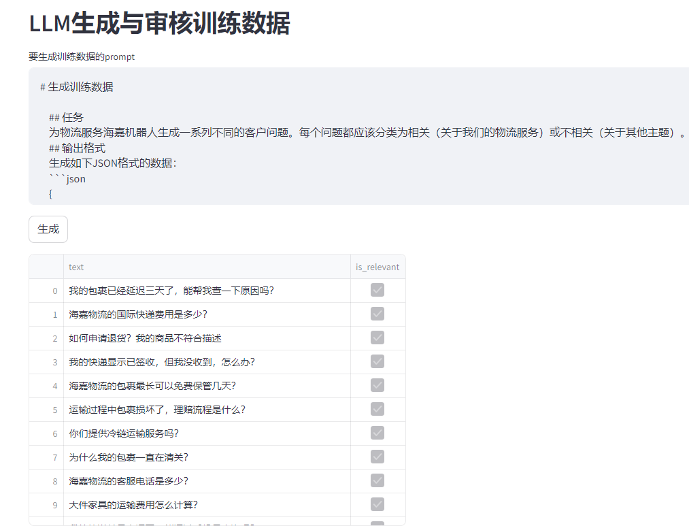
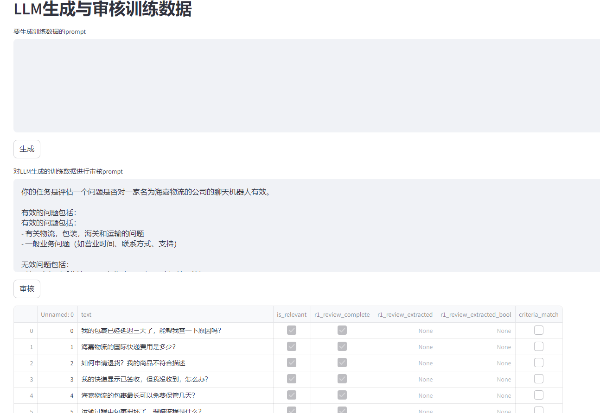

利用大模型LLM生成训练数据

这里假设一家海嘉物流公司，此公司需做一个关于本公司物流的问答机器人，需要判断用户的查询语句是否与本公司物流相关，需要分类用训练数据，故利用deepseek进行生成与审核，

免于无数据的和标注的烦恼。
- **dataset_generation.py**: 使用DeepSeek-V3生成不同的物流和非物流相关查询数据集
- **dataset_review.py**: 使用DeepSeek-R1验证和检查生成的数据集
- 
- DeepSeek-V3充当数据生成器，用于生成多样化训练数据。
- DeepSeek-R1充当数据质量审核器，识别出分类模糊或可能错误的数据。

一个简化的界面：

